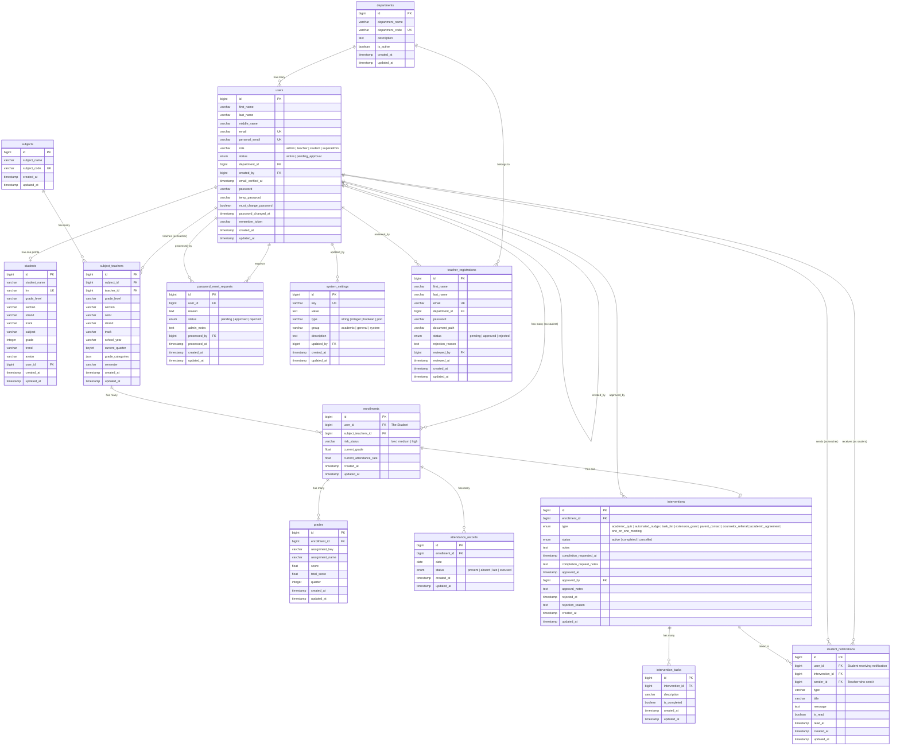

# 📊 Entity Relationship Diagram (ERD)

## SATIS — Smart Academic Tracking and Intervention System

---

## Mermaid ERD Diagram

---

## 📋 Tables Summary

| #   | Table                     | Description                                                 |
| --- | ------------------------- | ----------------------------------------------------------- |
| 1   | `departments`             | Academic departments within the institution                 |
| 2   | `users`                   | All system users (super_admin, admin, teacher, student)     |
| 3   | `students`                | Extended student profile linked to a user                   |
| 4   | `subjects`                | Academic subjects offered                                   |
| 5   | `subject_teachers`        | Pivot: assigns a teacher to a subject (with section, year…) |
| 6   | `enrollments`             | A student enrolled in a specific subject-teacher assignment |
| 7   | `grades`                  | Individual assignment scores per enrollment per quarter     |
| 8   | `attendance_records`      | Daily attendance status per enrollment                      |
| 9   | `interventions`           | Interventions triggered for at-risk enrollments             |
| 10  | `intervention_tasks`      | Checklist items within an intervention                      |
| 11  | `student_notifications`   | Notifications sent to students (nudges, alerts, feedback…)  |
| 12  | `password_reset_requests` | Password reset workflow requests                            |
| 13  | `system_settings`         | Key-value system configuration settings                     |
| 14  | `teacher_registrations`   | Pending teacher registration applications                   |

---

## 🔗 Relationships Detail

### `departments` → `users`

- **Type:** One-to-Many
- **FK:** `users.department_id` → `departments.id`
- A department can have many users (admins, teachers, students). Nullable — on delete set null.

### `users` → `students`

- **Type:** One-to-One
- **FK:** `students.user_id` → `users.id`
- A user (with role `student`) has one student profile. On delete cascade.

### `users` → `users` (self-referential)

- **Type:** One-to-Many
- **FK:** `users.created_by` → `users.id`
- A user (admin/super_admin) can create other users. Nullable — on delete set null.

### `subjects` → `subject_teachers`

- **Type:** One-to-Many
- **FK:** `subject_teachers.subject_id` → `subjects.id`
- A subject can be taught by many teachers (across different sections/years). On delete cascade.

### `users` → `subject_teachers`

- **Type:** One-to-Many
- **FK:** `subject_teachers.teacher_id` → `users.id`
- A teacher (user) can teach many subject assignments. On delete cascade.

### `subject_teachers` → `enrollments`

- **Type:** One-to-Many
- **FK:** `enrollments.subject_teachers_id` → `subject_teachers.id`
- A subject-teacher assignment can have many enrolled students. On delete cascade.

### `users` → `enrollments`

- **Type:** One-to-Many
- **FK:** `enrollments.user_id` → `users.id`
- A student (user) can be enrolled in many subject-teacher assignments. On delete cascade.

### `enrollments` → `grades`

- **Type:** One-to-Many
- **FK:** `grades.enrollment_id` → `enrollments.id`
- An enrollment can have many grade records (per assignment/quarter). On delete cascade.
- **Unique constraint:** `(enrollment_id, assignment_key, quarter)`

### `enrollments` → `attendance_records`

- **Type:** One-to-Many
- **FK:** `attendance_records.enrollment_id` → `enrollments.id`
- An enrollment can have many daily attendance records. On delete cascade.

### `enrollments` → `interventions`

- **Type:** One-to-One
- **FK:** `interventions.enrollment_id` → `enrollments.id`
- An enrollment can have one active intervention. On delete cascade.

### `interventions` → `intervention_tasks`

- **Type:** One-to-Many
- **FK:** `intervention_tasks.intervention_id` → `interventions.id`
- An intervention can have many checklist tasks. On delete cascade.

### `users` → `interventions` (approved_by)

- **Type:** One-to-Many
- **FK:** `interventions.approved_by` → `users.id`
- A teacher/admin can approve many interventions. Nullable — on delete set null.

### `users` → `student_notifications` (recipient)

- **Type:** One-to-Many
- **FK:** `student_notifications.user_id` → `users.id`
- A student receives many notifications. On delete cascade.

### `users` → `student_notifications` (sender)

- **Type:** One-to-Many
- **FK:** `student_notifications.sender_id` → `users.id`
- A teacher sends many notifications. Nullable — on delete set null.

### `interventions` → `student_notifications`

- **Type:** One-to-Many
- **FK:** `student_notifications.intervention_id` → `interventions.id`
- An intervention can trigger many notifications. Nullable — on delete cascade.

### `users` → `password_reset_requests` (requester)

- **Type:** One-to-Many
- **FK:** `password_reset_requests.user_id` → `users.id`
- A user can submit many password reset requests. On delete cascade.

### `users` → `password_reset_requests` (processor)

- **Type:** One-to-Many
- **FK:** `password_reset_requests.processed_by` → `users.id`
- An admin processes many password reset requests. Nullable — on delete set null.

### `users` → `system_settings`

- **Type:** One-to-Many
- **FK:** `system_settings.updated_by` → `users.id`
- An admin/super_admin can update many system settings. Nullable — on delete set null.

### `departments` → `teacher_registrations`

- **Type:** One-to-Many
- **FK:** `teacher_registrations.department_id` → `departments.id`
- A department receives many teacher registration applications. On delete cascade.

### `users` → `teacher_registrations` (reviewer)

- **Type:** One-to-Many
- **FK:** `teacher_registrations.reviewed_by` → `users.id`
- An admin reviews many teacher registrations. Nullable — on delete set null.

---

## 🏷️ Intervention Type Tiers

| Tier   | Type                 | Description        |
| ------ | -------------------- | ------------------ |
| Tier 1 | `academic_quiz`      | Academic Quiz      |
| Tier 1 | `automated_nudge`    | Reminder Nudge     |
| Tier 2 | `task_list`          | Goal Checklist     |
| Tier 2 | `extension_grant`    | Deadline Extension |
| Tier 2 | `parent_contact`     | Parent Contact     |
| Tier 3 | `counselor_referral` | Counselor Referral |
| Tier 3 | `academic_agreement` | Academic Agreement |
| Tier 3 | `one_on_one_meeting` | One-on-One Meeting |

---

## 👤 User Roles

| Role          | Description                                            |
| ------------- | ------------------------------------------------------ |
| `super_admin` | Full system access, manages admins and global settings |
| `admin`       | Department-level management, user creation, approvals  |
| `teacher`     | Manages subjects, grades, attendance, interventions    |
| `student`     | Views grades, attendance, receives interventions       |

---

> **Note:** This ERD is auto-generated from the Laravel migration files and Eloquent model relationships. Render the Mermaid diagram using any Mermaid-compatible Markdown viewer (GitHub, VS Code with Mermaid extension, etc.).
