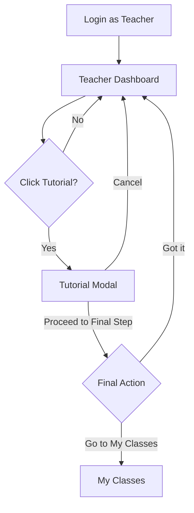

# SATIS System Flowchart Outline (Basic)

This document is a basic text outline for converting the current system into one or more flowcharts.

Format used:

- `Page/State -> Button or Action -> Route -> Next Page/State`

---

## 1) Entry, Login, and Role Redirect Flow

- `Guest -> Open App -> GET / -> Welcome Page`
- `Welcome Page -> Click Login -> GET /login -> Login Form`
- `Login Form -> Submit Credentials -> POST /login -> Redirect Handler (/redirect-after-login)`

Role decision after login:

- `If teacher -> GET /teacher/dashboard (teacher.dashboard) -> Teacher Dashboard`
- `If super_admin -> GET /superadmin/dashboard (superadmin.dashboard) -> Super Admin Dashboard`
- `If admin -> GET /admin/dashboard (admin.dashboard) -> Admin Dashboard`
- `If student -> GET /dashboard (dashboard) -> Student Dashboard`

Common auth exits:

- `Any Authenticated Page -> Click Logout -> POST /logout -> Guest/Welcome`
- `First Login or Forced Update -> GET /force-change-password -> Password Change Form`
- `Password Change Form -> Submit -> POST /force-change-password -> Role Dashboard`

---

## 2) Teacher Portal Flow

### A. Dashboard + Tutorial (your sample pattern)

- `Teacher Login -> Teacher Dashboard -> GET /teacher/dashboard`
- `Teacher Dashboard -> Click Tutorial -> Open Tutorial Modal (UI state)`
- `Tutorial Modal -> Cancel/Close -> Teacher Dashboard`
- `Tutorial Modal -> Proceed through steps -> Final Step`
- `Final Step -> Click Got it! -> Teacher Dashboard`
- `Final Step -> Click Go to My Classes -> GET /teacher/classes?highlight=addclass (teacher.classes.index) -> My Classes`

### B. Dashboard Quick Actions

- `Teacher Dashboard -> Click View Classes -> GET /teacher/classes (teacher.classes.index) -> My Classes`
- `Teacher Dashboard -> Click Upload Grades -> Upload Modal -> POST /teacher/classes/{subjectTeacher}/grades/import (teacher.classes.grades.import) -> Upload Result`
- `Teacher Dashboard -> Click New Intervention -> Intervention Modal -> POST /teacher/interventions (teacher.interventions.store) -> Intervention Result`
- `Teacher Dashboard -> Click Print Priority Report -> GET /teacher/dashboard/priority-students/export/pdf (teacher.dashboard.priority-students.pdf) -> PDF Download`

### C. My Classes Core Flow

- `My Classes -> Create Class -> POST /teacher/classes (teacher.classes.store) -> My Classes (updated)`
- `My Classes -> Edit Class -> PUT /teacher/classes/{subjectTeacher} (teacher.classes.update) -> My Classes (updated)`
- `My Classes -> Delete Class -> DELETE /teacher/classes/{subjectTeacher} (teacher.classes.destroy) -> My Classes (updated)`
- `My Classes -> Open Class -> GET /teacher/classes/{subjectTeacher} (teacher.class) -> Class Detail`

Student and grade actions inside class:

- `Class Detail -> Enroll Student -> POST /teacher/classes/{subjectTeacher}/students (teacher.classes.students.store) -> Class Detail (updated)`
- `Class Detail -> Upload Classlist -> POST /teacher/classes/{subjectTeacher}/classlist (teacher.classes.classlist.store) -> Class Detail (updated)`
- `Class Detail -> Start Quarter -> POST /teacher/classes/{subjectTeacher}/quarter (teacher.classes.quarter.start) -> Class Detail (updated)`
- `Class Detail -> Bulk Encode Grades -> POST /teacher/classes/{subjectTeacher}/grades/bulk (teacher.classes.grades.bulk) -> Class Detail (updated)`
- `Class Detail -> Recalculate Grades -> POST /teacher/classes/{subjectTeacher}/recalculate-grades (teacher.classes.recalculate-grades) -> Recalculated View`
- `Class Detail -> Update Grade Structure -> POST /teacher/classes/{subjectTeacher}/grade-structure (teacher.classes.grade-structure.update) -> Class Detail (updated)`
- `Class Detail -> Send Nudge -> POST /teacher/classes/{subjectTeacher}/nudge (teacher.classes.nudge) -> Nudge Confirmation`

Calculation branches:

- `Class Detail -> Calculate Class Grades -> GET /teacher/classes/{subjectTeacher}/calculate-grades (teacher.classes.calculate-grades) -> Grade Calculation Result`
- `Class Detail -> Calculate Student Grades -> GET /teacher/classes/{subjectTeacher}/students/{enrollment}/calculate-grades (teacher.classes.students.calculate-grades) -> Student Grade Result`

### D. Attendance and Interventions

- `Teacher Nav -> Attendance -> GET /teacher/attendance (teacher.attendance.index) -> Attendance Page`
- `Attendance Page -> Open Class Log -> GET /teacher/attendance/log/{subjectTeacher} (teacher.attendance.log.show) -> Attendance Log`
- `Attendance Log -> Export CSV -> GET /teacher/attendance/log/{subjectTeacher}/export (teacher.attendance.log.export) -> CSV Download`
- `Attendance Log -> Export PDF -> GET /teacher/attendance/log/{subjectTeacher}/export/pdf (teacher.attendance.log.export.pdf) -> PDF Download`
- `Attendance Page -> Submit Attendance -> POST /teacher/attendance (teacher.attendance.create) -> Attendance Updated`

- `Teacher Nav -> Interventions -> GET /teacher/interventions (teacher.interventions.index) -> Interventions Page`
- `Interventions Page -> Create One -> POST /teacher/interventions (teacher.interventions.store) -> Interventions Updated`
- `Interventions Page -> Bulk Create -> POST /teacher/interventions/bulk (teacher.interventions.bulk) -> Interventions Updated`
- `Interventions Page -> Approve Completion -> POST /teacher/interventions/{intervention}/approve (teacher.interventions.approve) -> Intervention Approved`
- `Interventions Page -> Reject Completion -> POST /teacher/interventions/{intervention}/reject (teacher.interventions.reject) -> Intervention Rejected`

Pending approval path:

- `Teacher Account (Pending) -> GET /teacher/pending-approval (teacher.pending-approval) -> Pending Approval Page`

---

## 3) Student Portal Flow

### A. Dashboard and Navigation

- `Student Login -> GET /dashboard (dashboard) -> Student Dashboard`
- `Student Dashboard -> Mark Notification Read -> POST /notifications/{notification}/read (notifications.read) -> Dashboard Updated`
- `Student Dashboard -> Mark All Notifications Read -> POST /notifications/read-all (notifications.read-all) -> Dashboard Updated`
- `Student Dashboard -> Go to Interventions Feed -> GET /interventions-feed (interventions-feed) -> Interventions Feed`
- `Student Dashboard -> Go to Risk Overview -> GET /analytics?risk=at-risk (analytics.index) -> Analytics List (At Risk Filter)`
- `Student Dashboard -> Go to Attendance -> GET /attendance (attendance) -> Attendance Page`
- `Student Dashboard -> Go to Analytics -> GET /analytics (analytics.index) -> Analytics List`

### B. Interventions and Analytics

- `Interventions Feed -> Complete Task -> POST /interventions/tasks/{task}/complete (interventions.tasks.complete) -> Task Status Updated`
- `Interventions Feed -> Request Completion -> POST /interventions/{intervention}/request-completion (interventions.request-completion) -> Request Sent`
- `Interventions Feed -> Mark Feedback Read -> POST /feedback/{notification}/read (feedback.read) -> Feedback Updated`

- `Analytics List -> Open Subject -> GET /analytics/{enrollment} (analytics.show) -> Subject Analytics Detail`
- `Subject Analytics Detail -> Export PDF -> GET /analytics/{enrollment}/export/pdf (analytics.show.pdf) -> PDF Download`

### C. Learn More / Tutorial-like UI Path

- `Student Nav -> Learn More -> GET /learn-more (learn-more) -> Learn More Page`
- `Learn More Page -> Open Tutorial Card -> Tutorial Modal Open (UI state)`
- `Tutorial Modal -> Cancel/Close -> Learn More Page`
- `Tutorial Modal -> Complete Steps -> Learn More Page`

---

## 4) Admin Portal Flow

### A. Dashboard to User Management

- `Admin Login -> GET /admin/dashboard (admin.dashboard) -> Admin Dashboard`
- `Admin Dashboard -> Open Users -> GET /admin/users (admin.users.index) -> Users Management`

User actions:

- `Users Management -> Create User -> POST /admin/users (admin.users.store) -> Users Updated`
- `Users Management -> Edit User -> GET /admin/users/{user}/edit (admin.users.edit) -> Edit Form`
- `Edit Form -> Save User -> PUT /admin/users/{user} (admin.users.update) -> Users Updated`
- `Users Management -> Delete User -> DELETE /admin/users/{user} (admin.users.destroy) -> Users Updated`
- `Users Management -> Reset Password -> POST /admin/users/{user}/reset-password (admin.users.reset-password) -> Reset Confirmation`
- `Users Management -> Bulk Delete -> POST /admin/users/bulk-destroy (admin.users.bulk-destroy) -> Users Updated`

### B. Sections, Classes, and Requests

- `Admin Nav -> Sections -> GET /admin/sections (admin.sections.index) -> Sections Page`
- `Sections Page -> Create Section -> POST /admin/sections (admin.sections.store) -> Sections Updated`

- `Admin Nav -> Classes -> GET /admin/classes (admin.classes.index) -> Classes Page`
- `Classes Page -> Create Class -> POST /admin/classes (admin.classes.store) -> Classes Updated`
- `Classes Page -> Update Class -> PUT /admin/classes/{schoolClass} (admin.classes.update) -> Classes Updated`
- `Classes Page -> Delete Class -> DELETE /admin/classes/{schoolClass} (admin.classes.destroy) -> Classes Updated`

- `Admin Nav -> Password Reset Requests -> GET /admin/password-reset-requests (admin.password-reset-requests) -> Requests Page`
- `Requests Page -> Approve -> POST /admin/password-reset-requests/{passwordResetRequest}/approve (admin.password-reset-requests.approve) -> Request Approved`
- `Requests Page -> Reject -> POST /admin/password-reset-requests/{passwordResetRequest}/reject (admin.password-reset-requests.reject) -> Request Rejected`

- `Admin Nav -> Teacher Registrations -> GET /admin/teacher-registrations (admin.teacher-registrations.index) -> Registrations Page`
- `Registrations Page -> Approve -> POST /admin/teacher-registrations/{registration}/approve (admin.teacher-registrations.approve) -> Approved`
- `Registrations Page -> Reject -> POST /admin/teacher-registrations/{registration}/reject (admin.teacher-registrations.reject) -> Rejected`
- `Registrations Page -> Download Document -> GET /admin/teacher-registrations/{registration}/document (admin.teacher-registrations.document) -> File Download`

---

## 5) Super Admin Portal Flow

### A. Dashboard and Departments

- `Super Admin Login -> GET /superadmin/dashboard (superadmin.dashboard) -> Super Admin Dashboard`
- `Super Admin Nav -> Departments -> GET /superadmin/departments (superadmin.departments.index) -> Departments Page`
- `Departments Page -> Create -> POST /superadmin/departments (superadmin.departments.store) -> Departments Updated`
- `Departments Page -> View Department -> GET /superadmin/departments/{department} (superadmin.departments.show) -> Department Detail`
- `Departments Page -> Edit -> GET /superadmin/departments/{department}/edit (superadmin.departments.edit) -> Edit Form`
- `Edit Form -> Save -> PUT /superadmin/departments/{department} (superadmin.departments.update) -> Department Updated`
- `Departments Page -> Delete -> DELETE /superadmin/departments/{department} (superadmin.departments.destroy) -> Departments Updated`
- `Departments Page -> Toggle Active/Inactive -> POST /superadmin/departments/{department}/toggle-status (superadmin.departments.toggle-status) -> Status Updated`
- `Departments Page -> Unassigned Teachers -> GET /superadmin/departments/unassigned-teachers (superadmin.departments.unassigned-teachers) -> Unassigned List`
- `Departments Page -> Department Teachers -> GET /superadmin/departments/{department}/teachers (superadmin.departments.teachers) -> Teacher List`

### B. Subjects, Users, Admins, and Settings

- `Super Admin Nav -> Subjects -> GET /superadmin/subjects (superadmin.subjects.index) -> Subjects Page`
- `Subjects Page -> Create/Update/Delete -> POST|PUT|DELETE /superadmin/subjects[...] -> Subjects Updated`

- `Super Admin Nav -> Users -> GET /superadmin/users (superadmin.users.index) -> Users Page`
- `Users Page -> Create/Update/Delete -> POST|PUT|DELETE /superadmin/users[...] -> Users Updated`

- `Super Admin Nav -> Admins -> GET /superadmin/admins (superadmin.admins.index) -> Admins Page`
- `Admins Page -> CRUD -> Resource Routes /superadmin/admins[...] -> Admins Updated`
- `Admins Page -> Reset Password -> POST /superadmin/admins/{admin}/reset-password (superadmin.admins.reset-password) -> Reset Confirmation`
- `Admins Page -> Resend Credentials -> POST /superadmin/admins/{admin}/resend-credentials (superadmin.admins.resend-credentials) -> Sent Confirmation`

- `Super Admin Dashboard/Settings -> Start New School Year -> POST /superadmin/new-school-year (superadmin.new-school-year.start) -> Year Started`
- `Super Admin Nav -> Settings -> GET /superadmin/settings (superadmin.settings.index) -> Settings Page`
- `Settings Page -> Save General Settings -> POST /superadmin/settings (superadmin.settings.update) -> Settings Saved`
- `Settings Page -> Update Academic/Enrollment/Grading/School Info -> PUT specific settings routes -> Settings Saved`
- `Settings Page -> Run Rollover -> POST /superadmin/settings/rollover (superadmin.settings.rollover) -> Rollover Result`

---

## 6) Shared Profile and Account Management Flow

- `Authenticated User -> Open Profile -> GET /profile (profile.edit) -> Profile Page`
- `Profile Page -> Save Changes -> PATCH /profile (profile.update) -> Profile Updated`
- `Profile Page -> Delete Account -> DELETE /profile (profile.destroy) -> Account Removed`

Teacher password-reset-request flow:

- `Profile Page -> Request Password Reset -> POST /profile/request-password-reset (profile.request-password-reset) -> Request Submitted`
- `Profile Page -> Cancel Password Reset Request -> DELETE /profile/cancel-password-reset (profile.cancel-password-reset) -> Request Cancelled`

---

## 7) Mermaid Starter Example (Teacher Tutorial Branch)

Use the same pattern for Student, Admin, and Super Admin modules:

- `Start Page -> Action Button -> Route -> Next Page`
- Add decision nodes for `Approve/Reject`, `Cancel/Proceed`, and `Success/Error` branches.
